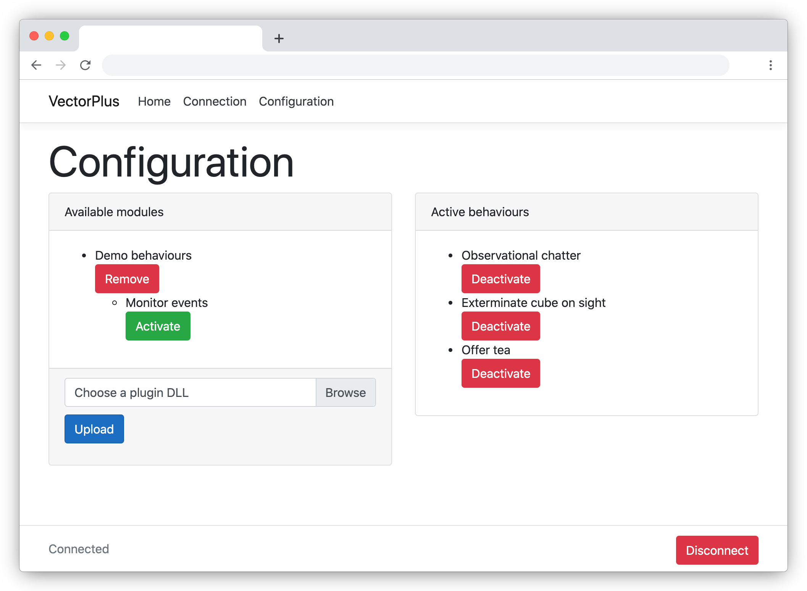

# VectorPlus

A C# library, framework and server for defining and managing new behaviours for the Vector robot (created by Anki, now supported by Digital Dream Labs).

VectorPlus communicates with your robot using the unofficial C# library [Anki.Vector.SDK](https://codaris.github.io/Anki.Vector.SDK/). It is designed to run continuously and maintain a connection to your Vector robot over your home wifi network.

## Context

The SDK allows programs to access and control the Vector robot. Some capabilities require that the SDK take full control of the robot. While that is happening, the robot is locked.

__VectorPlus__ creates behaviours that only take control of the robot as they need it, and release that control afterwards.

## Current state

The project is still in early stages. You can launch it using VisualStudio and connect to your robot, or run it in a Docker container on any machine.

In planning:

* Some better state tracking facilities.
* Some more interesting demo behaviours.
* Some documentation for writing your own behaviour modules.
* Distribute `VectorPlus.Lib` as a Nuget package for developers to build against.

## Running your VectorPlus server

VectorPlus is under development - some of these details may change...

### Launching with Visual Studio

Download the solution, and run the __VectorPlus.Web__ application with Visual Studio. It's a web server, so you can visit: http://localhost:5000 to test it on your own machine.

### Launching through Docker

There are a number of scripts to help you get started running the app in a Docker container:

* `docker-build.sh` - this builds a docker image tagged `vectorplusapp` using `VectorPlus.Web/Dockerfile`.
* `docker-run.sh` - this starts a docker container named `vectorplus`, running the app published on port 5000. 
* `docker-stop.sh` - this stops and removes the `vectorplus` docker container.

### Connecting to the robot

By default, the application will pick up your Vector SDK configuration. If you're running on a personal machine where you've already set up the SDK, you don't need to do anything.

If you're running VectorPlus as a server on a separate machine (or inside Docker), you can configure the robot's SDK connection through the __Connection__ page.

### Enabling behaviours

Head over to the __Configuration__ page, and upload a module. `VectorPlus.Demo.Behaviour.dll` is the same module which you can build as a part of this Visual Studio solution. From there you can activate a number of different behaviours to try out with Vector.

## Developing new behaviours

VectorPlus is intended to make it easy to build new behaviours that can co-exist. They can be bundled up and distributed as modules in DLL form for others to install.

* See: [Developer Notes](DeveloperNotes.md)

__TODO: bundle VectorPlus.Lib as a Nuget package.__

## Credit

Huge credit to [Digital Dream Labs](https://www.digitaldreamlabs.com/) for picking up where Anki left off, maintaining and supporting both Cosmo and Vector robots. If you haven't already purchased a subscription to updates, you can do so at their site.

* This project was created and maintained by [Lewis Westbury](https://twitter.com/instantiator).
* The unofficial C# [Anki.Vector.SDK](https://codaris.github.io/Anki.Vector.SDK/), created and maintained by [Wayne Venables](https://github.com/codaris).
* This project was inspired by [VectorCloud](https://github.com/rmountjoy92/VectorCloud) and [VectorCloud2](https://github.com/rmountjoy92/VectorCloud2) python servers created by [rmountjoy92](https://github.com/rmountjoy92).
* See also: The official [Python Vector SDK](https://developer.anki.com/vector/docs/index.html).

### Other useful tools

* Vector Explorer: https://www.weekendrobot.com/vectorexplorer
* VectorConfigure: https://www.weekendrobot.com/devtools
