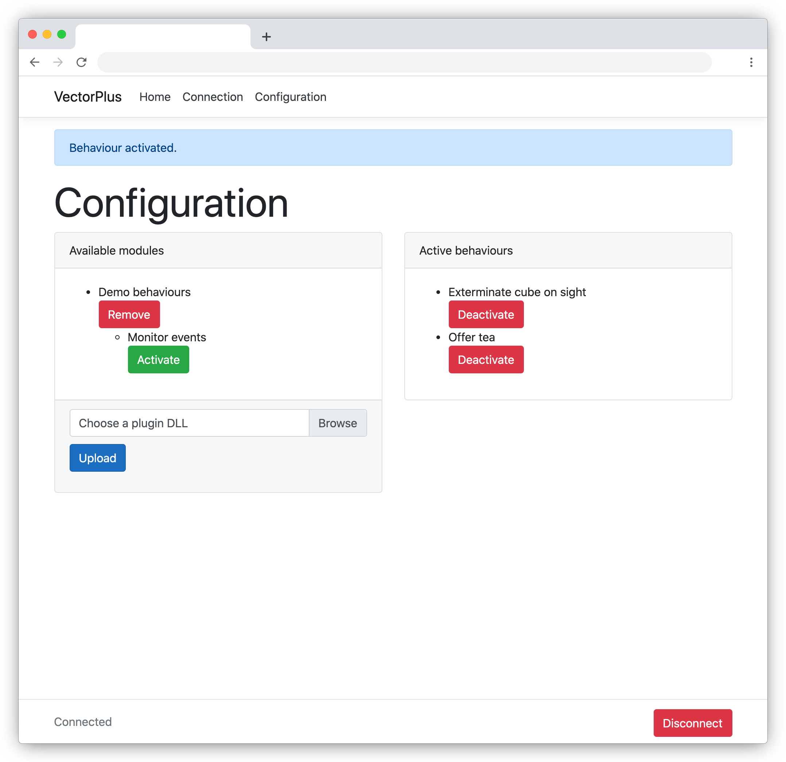

# VectorPlus

A C# library, framework and server for defining and managing new behaviours for the Vector robot (created by Anki, now supported by Digital Dream Labs), through the (unofficial) C# SDK.

## Context

The SDK allows programs to access and control the Vector robot. Some capabilities require that the SDK take full control of the robot. While that is happening, the robot is locked.

__VectorPlus__ creates behaviours that only take control of the robot as they need it, and release that control afterwards.

## Running your VectorPlus server

This library is in the early stages of development. Download the solution, and run the __VectorPlus.Web__ application with Visual Studio. It's a web server, so visit: http://localhost:5003 to test on your local machine.

By default, the application will pick up your Vector SDK configuration. 

To run VectorPlus as a server on a dedicated machine, you can configure the connection it through the web UI.

Once configured, head over to the configuration page, and upload a module. `VectorPlus.Demo.Behaviour.dll` is a good one to try. From there you can activate a number of different behaviours to try out with Vector.

## VectorPlusLib

### Concepts

When a Behaviour wishes to issue commands to the robot, it can place Actions in a queue to be run when the robot is free. This helps to distinguish between background Behaviour activity (ie. waiting for an event, such as an object being observed) and foreground Actions (such as moving the robot).

Unfortunately, there's a slight naming clash between Behaviours as defined by VectorPlus and Behaviours (reasonably complex pre-programmed actions that you can ask Vector to do through the SDK). To distinguish, the VectorPlus framework names key classes with a 'Plus' suffix.

VectorPlus will only take full control of the robot to execute individual Actions, or if a Behaviour is added that explicitly requires full control.

* __The VectorControllerPlus__ is responsible for managing a reasonably stable connection to Vector, until it is Disposed.
  * (Remember to DisposeAsync it once you have finished with it.)
  * It also manages full control of the robot - releasing Vector whenever it isn't needed.
* __A VectorBehaviourPlus__ can be added to the VectorControllerPlus. Once added, there are 3 ways for it to interact with Vector:
  * It can register itself with any Vector events it is using as triggers.
  * It enqueues some initial ActionPlus when it first connects.
  * Its main loop is started which can also enqueue actions.
* __A VectorActionPlus__ is the smallest unit of instruction passed to Vector.
  * It can contain any number of instructions for the robot.
  * If required (likely) it asks the VectorControllerPlus to take full control for it.

### Implementing your own behaviours

_TODO: document this_
